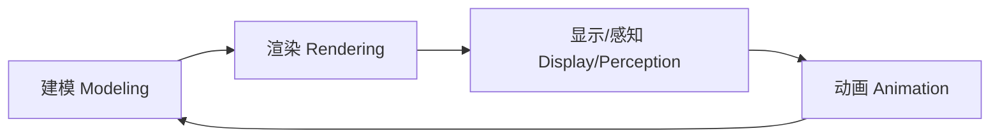

# 01 — 导论与图形学历史

- [1. 计算机图形学定义与核心问题](#1-计算机图形学定义与核心问题)
- [2. 两大渲染范式：光栅化 vs 光线追踪](#2-两大渲染范式光栅化-vs-光线追踪)
- [3. 显示硬件发展史](#3-显示硬件发展史)
- [4. 输入硬件发展史](#4-输入硬件发展史)
- [5. 渲染算法发展史（重点）](#5-渲染算法发展史重点)
- [6. GPU 发展简史](#6-gpu-发展简史)
- [7. VR/AR 发展](#7-vrar-发展)
- [8. 图形学与深度学习](#8-图形学与深度学习)
- [9. 物体表示 (Object Representation)](#9-物体表示-object-representation)
- [常见考点](#-常见考点)
- [关键词索引](#关键词索引)

---

## 1. 计算机图形学定义与核心问题

- **定义**：利用计算机生成和显示图像
- **四大核心研究问题**：
  - **建模 (Modeling)**：场景中有什么？（几何、材质、光照描述）
  - **渲染 (Rendering)**：图像长什么样？（从场景描述生成像素）
  - **动画 (Animation)**：随时间如何变化？（运动、变形、物理模拟）
  - **感知 (Perception)**：人如何看到？（显示设备、视觉感知）

---

## 2. 两大渲染范式：光栅化 vs 光线追踪

> **考点：** 这是贯穿整门课程的核心对比，老师很可能考概念辨析。

| 维度 | 光栅化 (Rasterization) | 光线追踪 (Ray Tracing) |
| :--- | :--- | :--- |
| **基本思路** | 将图元投影到屏幕，逐像素着色 | 从眼睛发出一条光线穿过像素，追踪其在场景中的弹射 |
| **处理顺序** | 物体 → 像素（object order） | 像素 → 物体（image order） |
| **可见性** | Z-buffer 逐像素比较深度 | 光线求交自然解决 |
| **全局光照** | 需额外算法（Shadow Map, SSAO, Lightmap 等） | 天然支持反射、折射、阴影 |
| **性能** | 快，适合实时渲染（游戏） | 慢，传统用于离线渲染（电影） |
| **硬件** | 传统 GPU 管线（顶点→光栅→像素） | RT Core (NVIDIA RTX)、OptiX |
| **代表 API** | OpenGL, Vulkan, Direct3D | OptiX, Vulkan RT, DXR |

**现代趋势**：混合渲染（Hybrid Rendering）— 光栅化做主渲染 + 光线追踪做反射/阴影/全局光照（如 UE5 Lumen）。

---

## 3. 显示硬件发展史

| 年代 | 技术 | 代表 |
| :--- | :--- | :--- |
| 1963 | 矢量显示（改进示波器） | — |
| 1974 | 矢量图形系统 | Evans & Sutherland Picture System |
| 1975 | 帧缓存（Framebuffer）诞生 | — |
| 1980s | 廉价帧缓存 → 位图 PC | — |
| 1990s | 液晶显示 (LCD) | — |
| 2000s | 微镜投影 / 数字影院 | DLP |
| 2010s | HDR 显示 | VESA DisplayHDR 标准 |

**HDR 显示标准**（VESA DisplayHDR）：
- 400/500/600/1000/1400：LCD 背光分级
- True Black 400/500/600：OLED 每像素控光，黑位更纯

**沉浸式显示**：立体头戴显示器 (HMD)、Reality Center、DOME、CAVE

---

## 4. 输入硬件发展史

| 维度 | 时期 | 技术 |
| :--- | :--- | :--- |
| **2D 输入** | 早期 | 光笔、鼠标、摇杆、轨迹球、触摸板 |
| | 1970-80s | CCD 传感器 + 帧采集器 |
| | 1990-2000s | CMOS 数字传感器 + HDR 成像 |
| **3D 输入** | 1980s | 3D 追踪器 |
| | 1990s | 主动测距仪 |
| **4D+** | — | 多相机（光场）、多臂龙门架 |
| **RGBD 相机** | 2010s | FaceID (Apple), Kinect DK (Microsoft), TOF AR 相机 |

---

## 5. 渲染算法发展史（重点）

> **考点：** 老师可能出"将下列算法按时间排序"或"某某算法属于哪个年代/学派"的选择题。

### 1960s — 可见性问题（奠基期）
- Roberts, Appel → 隐藏线消除 (Hidden Line)
- Warnock, Witkins → 隐藏面消除 (Hidden Surface)
- Sutherland → **可见性 = 排序问题**

### 1970s — 光栅图形（经典局部光照）
| 人名 | 贡献 |
| :--- | :--- |
| Gouraud | 漫反射光照 + 顶点颜色插值 |
| Phong | 高光光照模型 |
| Blinn | 曲面建模、纹理映射、Blinn-Phong 模型 |
| Crow | 抗锯齿 (Anti-aliasing) |

### 1980s — 全局光照（物理真实感）
| 人名/团队 | 贡献 |
| :--- | :--- |
| Whitted (1980) | **递归光线追踪**（反射+折射+阴影） |
| Goral, Torrance, Cohen | **辐射度方法** (Radiosity) |
| Kajiya (1986) | **渲染方程** (The Rendering Equation) — 统一理论框架 |

### 1980s 末 — 写实渲染 (Photorealistic Rendering)
- Cook: Shade Trees（着色树，可编程着色的前身）
- Perlin: 着色语言 + Perlin 噪声
- Hanrahan & Lawson: **RenderMan**（Pixar 的工业级渲染器）

### 1990s 初 — 非真实感渲染 (NPR)
- Drebin, Levoy: 体渲染 (Volume Rendering)
- Haeberli: 印象派绘制
- Salesin: 钢笔水墨插画
- Meier: 绘画风格渲染

### 1990s 中后期 — 基于图像的渲染 (IBR)
- McMillan: Plenoptic Modeling
- Levoy, Gortler: **光场 (Light Field / Lumigraph)**
- Shum, Kang: Concentric Mosaics

### 1990s 末 — 表面细节渲染
- Dana: 双向纹理函数 (BTF)
- Jensen: **BSSRDF**（次表面散射，皮肤/牛奶/大理石）
- Chen: Shell Texture Function

### 2000s 初 — 交互式全局光照
- Microsoft: PRT（预计算辐射度传输）
- GPU 加速全局光照 (NVIDIA, AMD, ZJU)
- 计算摄影、超分辨率立体媒体

### 2010s — 实时光线追踪
- NVIDIA RTX (2018)：硬件光线追踪核心
- Microsoft DXR, Vulkan RT：光线追踪 API 标准

### 2016 至今 — AI + 图形学
- 视频到视频合成 (NeurIPS 2018)
- AI 加速降噪器 (SIGGRAPH 2017) → NVIDIA DLSS（深度学习超采样）
- 深度学习用于人脸建模、动画、重演、角色动画

---

## 6. GPU 发展简史

> 理解 GPU 架构演变有助于理解为什么渲染管线是这样的设计。

| 阶段 | 年代 | 特征 | 代表 |
| :--- | :--- | :--- | :--- |
| **固定功能管线** | 1990s | 硬件写死变换/光照/光栅化，不可编程 | 早期 OpenGL/Direct3D |
| **可编程管线** | 2001+ | 顶点/像素着色器可编程 | GeForce 3, Shader Model 1.0 |
| **统一着色器** | 2006+ | VS/PS/GS 共用处理器核心 | GeForce 8800 (CUDA 架构) |
| **GPGPU** | 2006+ | GPU 用于通用计算 | CUDA, OpenCL, Brook |
| **硬件光线追踪** | 2018+ | 专用 RT Core 加速光线求交 | NVIDIA RTX 20/30/40 系列, OptiX |
| **Mesh Shader** | 2018+ | 替代传统 IA/VS/GS，更灵活的几何管线 | NVIDIA Turing+, Vulkan Mesh Shader（网格着色器） |
| **AI 加速** | 2018+ | Tensor Core 加速推理 | DLSS, AI 降噪 |

---

## 7. VR/AR 发展

| 公司 | 产品/技术 | 定位 |
| :--- | :--- | :--- |
| Facebook (Meta) | Quest 系列 | 消费级 VR 一体机 |
| Microsoft | HoloLens | AR 头显（企业级） |
| Apple | Vision Pro, ARKit | 空间计算 + 移动 AR |
| Google | Android XR, ARCore | 移动 AR 平台 |
| Valve | Lighthouse, Index, HTC Vive | 高端 PC VR |
| 国内 | Rokid 等 | 消费级 AR 眼镜 |

### XR HMD 与 Projection-Based System

**头戴式显示 (HMD, Head-Mounted Display)**：
- **VR HMD**：封闭式，完全替代现实视野（Quest, Index, PSVR）
- **AR HMD**：透视式 (See-through)，叠加数字信息到现实（HoloLens, Vision Pro）
- **MR (混合现实, Mixed Reality)**：虚拟与现实物体可交互（Vision Pro 的"空间计算"）

**投影式系统 (Projection-Based System)**：
- **CAVE (洞穴自动虚拟环境, Cave Automatic Virtual Environment)**：多面投影（墙壁+地板+天花板），多人共享
- **DOME**：穹顶投影，飞行/驾驶模拟
- **Reality Center**：大型环绕屏幕，工业设计评审

| 维度 | HMD | Projection-Based |
|:---|:---|:---|
| 沉浸感 | 高（完全封闭） | 中（需固定位置） |
| 多人共享 | 困难 | 自然 |
| 分辨率 | 每眼独立 | 拼接投影 |
| 成本 | 低（消费级） | 极高（专业设施） |

### 6G 与沉浸式体验

**6G (第六代移动通信)** 预计 2030 年代商用，对 XR 的关键推动：

- **超高带宽 (Tbps 级)**：无线传输 16K+ 全景视频
- **亚毫秒延迟 (<1ms)**：消除运动→显示延迟的晕动症
- **全息通信 (Holographic Communication)**：实时 3D 人体重建 + 传输
- **感知互联**：6G 与 XR 结合 → 物理世界与数字世界的无缝融合

---

## 9. 物体表示 (Object Representation)

### 代表工作 (2016 起)

**人脸建模与动画**：
- Memoji (Apple)
- 面部与语音动画
- 面部重演 (Facial Reenactment)
- DreamFace (SIGGRAPH 2023)：文本驱动 3D 人脸生成
- SketchFaceNeRF (SIGGRAPH 2023)

**角色动画**：
- DeepMimic：深度强化学习驱动物理角色技能
- Motion2Fusion：实时体积动作捕捉
- MEGATrack：VR 手部追踪
- 眼-脸联合模型：照片级真实感面部动画

### AI 对渲染的影响
- **DLSS（深度学习超采样）/ FSR（AMD 超分辨率）/ XeSS（Intel 超采样）**：AI 超分辨率，低分辨率渲染 → 高分辨率输出
- **AI 降噪**：减少蒙特卡洛路径追踪所需的采样数
- **NeRF（神经辐射场）/ 3D Gaussian Splatting（三维高斯泼溅）**：用神经网络隐式表示场景

---

## 9. 物体表示 (Object Representation)

> **考点：** 各种 3D 表示方式的区别和适用场景。

### 9.1 主要表示方式

| 表示方式 | 描述 | 优点 | 缺点 |
|:---|:---|:---|:---|
| **Point Cloud（点云）** | 无序三维点集合 (XYZ) | 简单、原始数据直接 | 无拓扑、无表面、稀疏 |
| **Mesh（网格）** | 顶点 + 边 + 面（三角形） | 标准表示、硬件支持 | 拓扑固定、细分困难 |
| **Voxel（体素）** | 3D 像素网格 | 规则结构、适合 CNN | 存储 $O(n^3)$，分辨率受限 |
| **Subdivision Surface（细分曲面）** | 粗糙控制网格 → 递归细分 → 光滑极限曲面 | 任意拓扑的光滑表面 | 计算开销 |
| **Procedural（程序化）** | 用算法/规则生成几何（如 L-system, Perlin 噪声） | 无限细节、存储极小 | 不易控制、设计困难 |
| **Implicit Surface（隐式曲面）** | $f(x,y,z)=0$ 定义（如 SDF） | 拓扑灵活、布尔运算简单 | 渲染慢（需 Ray Marching） |

### 9.2 细分曲面 (Subdivision Surface)

**思想**：从粗糙的控制网格出发，反复应用细分规则 → 极限光滑曲面。

**经典算法**：

| 算法 | 面类型 | 极限光滑度 |
|:---|:---|:---|
| **Catmull-Clark** | 四边形 | $C^2$（除奇异点外 $C^1$） |
| **Loop** | 三角形 | $C^2$（除奇异点外 $C^1$） |
| **Doo-Sabin** | 任意 | $C^1$ |

**Pixar 的贡献**：Catmull-Clark 细分曲面是 Pixar 动画电影的核心几何表示（Geri's Game, 1997）。

### 9.3 程序化表示 (Procedural Representation)

**核心思想**：不存储几何数据，而是存储**生成规则**，运行时按需生成。

| 方法 | 应用 |
|:---|:---|
| **L-System** | 植物/树木建模 |
| **Perlin 噪声** | 地形、云、大理石纹理 |
| **分形 (Fractal)** | 山脉、海岸线 |
| **Shape Grammars** | 建筑/城市生成 |

**优势**：极低存储 + 无限细节（放大永远不会看到"模糊"）。

### 9.4 AI 表示与建模

| 技术 | 核心思想 | 代表性论文 |
|:---|:---|:---|
| **NeRF** | 用 MLP 将 $(x,y,z,\theta,\phi)$ 映射为颜色+密度 | Mildenhall et al., ECCV 2020 |
| **3D Gaussian Splatting** | 用大量 3D 高斯球显式表示场景，实时渲染 | Kerbl et al., SIGGRAPH 2023 |
| **CAD Agent** | 用 LLM/Coding Agent 通过代码生成 CAD 模型 | 新兴方向 |

**Gaussian Splatting vs NeRF**：

| 维度 | NeRF | 3D Gaussian Splatting |
|:---|:---|:---|
| 表示 | 隐式 (MLP) | 显式 (高斯球) |
| 渲染 | 体渲染 (Ray Marching) | 投影 + 光栅化 |
| 速度 | 慢（需查询 MLP 数十次） | 快（实时 >30 FPS） |
| 编辑性 | 困难 | 较容易（移动/删除高斯球） |

---

## 常见考点

1. **渲染方程由谁在何时提出？** → Kajiya, 1986
2. **Whitted 的贡献是什么？** → 递归光线追踪（反射+折射+阴影），1980
3. **光栅化 vs 光线追踪的本质区别？** → object order vs image order
4. **Gouraud 和 Phong 分别在着色领域的贡献？** → Gouraud: 顶点颜色插值; Phong: 高光模型
5. **GPU 从固定管线到可编程管线的转折点？** → GeForce 3 (2001), Shader Model 1.0
6. **实时渲染和离线渲染的典型代表方案？** → 光栅化 (游戏) vs 路径追踪 (电影)
7. **Point Cloud / Mesh / Voxel / Subdivision Surface 的区别？** → 点云无拓扑、Mesh 标准硬件支持、Voxel 规则网格、Subdivision 递归细分光滑
8. **3D Gaussian Splatting vs NeRF 的核心区别？** → GS 显式高斯球+光栅化（快、可编辑），NeRF 隐式 MLP+体渲染（慢、难编辑）
9. **HMD vs Projection-Based VR 的区别？** → HMD 沉浸感高但难以共享，投影式自然多人但成本极高

---

## 关键词索引

`计算机图形学` `建模` `渲染` `动画` `光栅化` `光线追踪` `Whitted` `Kajiya` `渲染方程` `Phong` `Gouraud` `Blinn` `GPGPU` `CUDA` `RTX` `OptiX` `VR` `AR` `MR` `HDR` `帧缓存` `Shader` `固定管线` `可编程管线` `DLSS` `NeRF` `Gaussian Splatting` `RenderMan` `Radiosity` `BRDF` `BSSRDF` `Light Field` `IBR` `NPR` `全局光照` `实时渲染` `离线渲染` `Point Cloud` `Mesh` `Voxel` `Subdivision Surface` `Catmull-Clark` `Procedural` `CAD Agent` `HMD` `CAVE` `Projection-Based` `6G`
