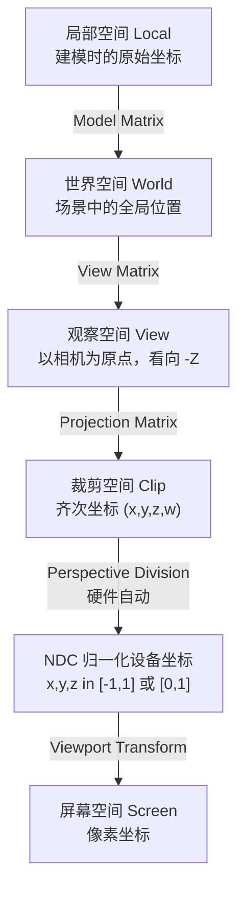

# 04 — 观察、投影与裁剪

> **核心问题**：如何将 3D 世界中的物体映射到 2D 屏幕上，并剔除屏幕外的部分？

- [1. 相机模型](#1-相机模型)
- [2. 观察变换 (View Transform)](#2-观察变换-view-transform)
- [3. 投影变换 (Projection Transform)](#3-投影变换-projection-transform)
- [4. 裁剪 (Clipping)](#4-裁剪-clipping)
- [5. 视口变换 (Viewport Transform)](#5-视口变换-viewport-transform)
- [6. 完整坐标空间变迁](#6-完整坐标空间变迁)
- [常见考点](#-常见考点)
- [关键词索引](#关键词索引)

---

## 1. 相机模型

### 1.1 针孔相机模型 (Pinhole Camera Model)
- 无畸变，所有光线汇聚于一点（投影中心/视点）
- 这是计算机图形学渲染的标准模型

### 1.2 相机参数

| 参数 | 含义 |
| :--- | :--- |
| **Eye (视点)** | 相机在世界空间中的位置 |
| **Look-at (观察方向)** | 相机看向的目标点 |
| **Up (上方向)** | 确定相机"朝上"的朝向 |
| **FOV (视场角)** | 垂直（或水平）可见角度范围 |
| **Near plane (近裁剪面)** | 近裁剪面距离 |
| **Far plane (远裁剪面)** | 远裁剪面距离 |
| **视平面 (View Plane)** | 近平面上的成像矩形 |

### 1.3 视锥体 (View Frustum)

由近平面和远平面定义的截头四棱锥（平截头体），只有视锥体内的物体才可见。

---

## 2. 观察变换 (View Transform)

**目的**：将世界坐标系转换到相机坐标系（以相机为原点，看向 -Z 方向）。

### 构造方法

给定 eye 位置 $\mathbf{e}$、look-at 点 $\mathbf{a}$、up 向量 $\mathbf{u}$：

1. **后向量** $\mathbf{f}$：$\mathbf{f} = \text{normalize}(\mathbf{e} - \mathbf{a})$（指向 +Z 的反方向，即相机看的方向）
2. **右向量** $\mathbf{r}$：$\mathbf{r} = \text{normalize}(\mathbf{u} \times \mathbf{f})$
3. **上向量** $\mathbf{u}'$：$\mathbf{u}' = \mathbf{f} \times \mathbf{r}$（正交化的 up）

观察矩阵：
$$M_{view} = \begin{bmatrix}
r_x & r_y & r_z & -\mathbf{r}\cdot\mathbf{e} \\
u'_x & u'_y & u'_z & -\mathbf{u}'\cdot\mathbf{e} \\
f_x & f_y & f_z & -\mathbf{f}\cdot\mathbf{e} \\
0 & 0 & 0 & 1
\end{bmatrix}$$

> OpenGL **右手系 (Right-handed)** 看向 -Z；Direct3D/Vulkan **左手系 (Left-handed)** 看向 +Z。本笔记以 OpenGL 约定为主。

---

## 3. 投影变换 (Projection Transform)

### 3.1 两种投影对比

| 特性 | 正交投影 | 透视投影 |
| :--- | :--- | :--- |
| **视觉效果** | 无近大远小 | 近大远小，有立体感 |
| **变换形状** | 长方体 → 标准立方体 $[-1,1]^3$ | 视锥体 → 标准立方体 |
| **$w$ 分量** | 保持为 1 | 变为 $-z_e$（视图空间深度） |
| **深度关系** | **线性**（$Z_{ndc} \propto Z_{view}$） | **非线性**（$Z_{ndc} \propto 1/Z_{view}$） |
| **平行线** | 保持平行 | 不保持（除平行于视平面的线外） |
| **代表应用** | CAD 制图、2D 游戏、Shadow Map | 3D 游戏、VR、电影 |

### 3.2 正交投影矩阵

将一个轴对齐长方体（$[l,r] \times [b,t] \times [n,f]$，OpenGL 中 $n,f$ 为正数，看向 -Z）映射到 $[-1,1]^3$ 标准立方体：

$$M_{ortho} = \begin{bmatrix}
\frac{2}{r-l} & 0 & 0 & -\frac{r+l}{r-l} \\[4pt]
0 & \frac{2}{t-b} & 0 & -\frac{t+b}{t-b} \\[4pt]
0 & 0 & -\frac{2}{f-n} & -\frac{f+n}{f-n} \\[4pt]
0 & 0 & 0 & 1
\end{bmatrix}$$

**推导逻辑**：
- x 范围 $[l, r]$ → 先平移 $-(l+r)/2$ 到原点，再缩放 $2/(r-l)$ 到 $[-1,1]$
- y、z 同理。z 的负号来自 OpenGL 的 -Z 方向约定。

### 3.3 透视投影矩阵

#### 几何推导（核心）

**目标**：远处的物体压到近平面大小。

相似三角形（从侧面看）：
$$\frac{x_p}{x_e} = \frac{-n}{z_e} \quad\Rightarrow\quad x_p = \frac{n \cdot x_e}{-z_e}$$

**关键技巧**：让投影矩阵产生的 $w_{clip} = -z_e$，透视除法时 $(x_{clip}/w_{clip})$ 自动实现相似三角形缩放。

透视投影矩阵（OpenGL 风格，默认视锥体对称简化）：

$$M_{persp} = \begin{bmatrix}
\frac{2n}{r-l} & 0 & \frac{r+l}{r-l} & 0 \\[4pt]
0 & \frac{2n}{t-b} & \frac{t+b}{t-b} & 0 \\[4pt]
0 & 0 & -\frac{f+n}{f-n} & -\frac{2fn}{f-n} \\[4pt]
0 & 0 & -1 & 0
\end{bmatrix}$$

**逐步推导**（对称视锥体 $r=-l$, $t=-b$）：

1. **x 分量**：$x_{clip} = \frac{2n}{r-l} \cdot x_e$，分母 $w_{clip} = -z_e$，$x_{ndc} = x_{clip}/w_{clip} = \frac{n \cdot x_e}{-z_e} \cdot \frac{2}{r-l}$
2. **z 分量**：保守 $z_e \in [-n,-f]$ 的深度信息到 $[-1,1]$，但保持非线性映射
   - 令 $Z_{clip} = A \cdot z_e + B$，$W_{clip} = -z_e$
   - $Z_{ndc} = Z_{clip} / W_{clip} = -A - B/z_e$
   - 边界条件：$z_e=-n \Rightarrow Z_{ndc}=-1$, $z_e=-f \Rightarrow Z_{ndc}=1$
   - 解得 $A = -\frac{f+n}{f-n}$, $B = -\frac{2fn}{f-n}$
3. **w 分量**：$w_{clip} = -z_e$（第四行设为 $[0,0,-1,0]$）

#### 透视投影的深度非线性

$$Z_{ndc} = \frac{f+n}{f-n} + \frac{2fn}{(f-n) \cdot z_e}$$

其中 $z_e$ 为负值。**后果**：
- 近处精度极高、远处精度极低
- 这是**深度冲突 (Z-fighting)** 的数学根源

---

## 4. 裁剪 (Clipping)

### 4.1 裁剪在管线中的位置

裁剪发生在**裁剪空间**（投影变换之后、透视除法之前）。

在齐次坐标 $(x,y,z,w)$ 中进行，裁剪条件为：
$$-w \leq x \leq w,\quad -w \leq y \leq w,\quad -w \leq z \leq w \quad\text{(OpenGL)}$$

**为什么在裁剪空间裁剪？**
- 透视除法前裁剪 = 在完整的 3D 空间裁剪（非屏幕空间近似）
- 裁剪后再透视除法，避免除以 0 和除负数的复杂情况

### 4.2 点裁剪
判断点 $(x,y)$ 是否在窗口 $[x_{min}, x_{max}] \times [y_{min}, y_{max}]$ 内。

### 4.3 线段裁剪：Cohen-Sutherland 算法

#### 核心思想
把屏幕空间分成九宫格，用 4 位二进制码标记端点位置，先通过位运算快速接受或拒绝，无法判定时再循环求交。

#### 区域编码 (Region Codes)

| 位 | 条件 | 含义 |
| :--- | :--- | :--- |
| 第1位 | $y > y_{max}$ | 上 (Top) |
| 第2位 | $y < y_{min}$ | 下 (Bottom) |
| 第3位 | $x > x_{max}$ | 右 (Right) |
| 第4位 | $x < x_{min}$ | 左 (Left) |

例：左上角 = `1001`（上+左），窗口内部 = `0000`。

#### 判定规则

1. **完全可见 (Trivial Accept)**：两个端点编码**都是** `0000` → 直接保留
2. **完全不可见 (Trivial Reject)**：两个端点编码**按位与 (AND) $$\neq 0$$** → 同在窗口某侧之外，丢弃
3. **需要裁剪**：否则，按固定顺序求交（上→下→右→左），用交点替换外侧端点，重复测试

> 最多 4 次迭代即可裁剪完毕。本质是全整数位运算，效率极高。

#### 手算示例

> **考点：** 常见计算题：给定窗口和线段端点，写出算法每一步的编码和交点。

### 4.4 多边形裁剪：Sutherland-Hodgman 算法

#### 核心思想
**流水线式逐边裁剪**：将"矩形窗口裁剪多边形"分解为 4 次独立的"单边裁剪"。上一阶段的输出 = 下一阶段的输入。

#### 单边裁剪的 4 种情况

遍历多边形所有顶点，维护"上一顶点 S"和"当前顶点 P"：

| 情况 | S 位置 | P 位置 | 输出顶点 |
| :--- | :--- | :--- | :--- |
| **1. 全在内** | 内 | 内 | 输出 **P** |
| **2. 出界** | 内 | 外 | 输出 **交点 I**（P 不输出） |
| **3. 全在外** | 外 | 外 | 无输出 |
| **4. 进界** | 外 | 内 | 输出 **交点 I**，再输出 **P** |

#### 算法评价

| 优点 | 缺点 |
| :--- | :--- |
| 实现简单，逻辑清晰 | **只支持凸裁剪窗口** |
| 可扩展到 3D（裁剪体为六面体） | 凹多边形结果可能出现多余连线 |
| 流水线结构易于硬件实现 | 需遍历所有顶点多次 |

> **凹多边形裁剪**：需用 Weiler-Atherton 算法（处理顶点链表的交集和差集，更复杂）。

---

## 5. 视口变换 (Viewport Transform)

**目的**：将 NDC $[-1,1]^2$ 映射到屏幕像素坐标 $[0, width] \times [0, height]$。

$$M_{viewport} = \begin{bmatrix}
\frac{w}{2} & 0 & 0 & \frac{w}{2} \\[4pt]
0 & \frac{h}{2} & 0 & \frac{h}{2} \\[4pt]
0 & 0 & 1 & 0 \\[4pt]
0 & 0 & 0 & 1
\end{bmatrix}$$

其中 $w$ 和 $h$ 为视口宽高（像素）。z 值通常传递不变（或缩放到深度缓冲范围 $[0,1]$/$[-1,1]$）。

---

## 6. 完整坐标空间变迁

从模型到屏幕的完整变换链：

$$
\mathbf{p}_{screen} = M_{viewport} \cdot \left(\frac{M_{proj} \cdot M_{view} \cdot M_{model} \cdot \mathbf{p}_{local}}{w}\right)
$$

**两个关键矩阵的合并**（常考）：
$$M_{MVP} = M_{proj} \cdot M_{view} \cdot M_{model}$$

---

## 常见考点

1. **透视投影矩阵的推导**（尤其是第四行 $[0,0,-1,0]$ 为何要放 $-1$）→ 产生 $w=-z_e$，透视除法实现近大远小
2. **正交投影 vs 透视投影的深度线性性对比** → 正交是线性的，透视是 $1/Z_{view}$ 非线性的
3. **Cohen-Sutherland 的两种快速判定** → Trivial Accept（code1=code2=0000）和 Trivial Reject（code1 & code2 $$\neq 0$$）
4. **Sutherland-Hodgman 四种输出情况的手算** → 给定多边形顶点，写出每次裁剪后的顶点序列
5. **为什么在裁剪空间裁剪？** → 齐次坐标下裁剪可避免透视除法时的除零和符号翻转，且裁剪体是标准立方体
6. **摄像机三个基向量的构建** → $\mathbf{f}$（看的方向）, $\mathbf{r} = \mathbf{u} \times \mathbf{f}$, $\mathbf{u}' = \mathbf{f} \times \mathbf{r}$
7. **NDC 坐标范围在 OpenGL vs Vulkan/D3D 中的区别** → OpenGL z $$\in [-1,1]$$, Vulkan z $$\in [0,1]$$; 但 x,y 都是[-1,1]

---

## 关键词索引

`相机模型` `针孔相机` `视锥体` `FOV` `近平面` `远平面` `观察变换` `视点` `观察方向` `投影变换` `正交投影` `透视投影` `NDC` `裁剪空间` `裁剪` `Cohen-Sutherland` `区域编码` `Trivial Accept` `Trivial Reject` `Sutherland-Hodgman` `逐边裁剪` `流水线` `视口变换` `透视除法` `齐次坐标` `MVP矩阵` `局部空间` `世界空间` `观察空间` `屏幕空间`
