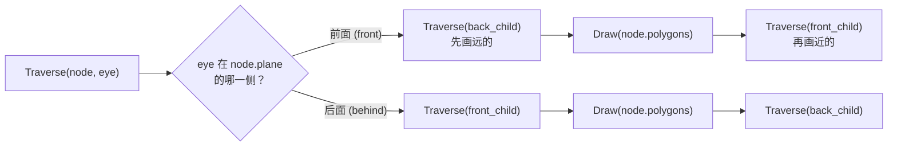

# 06 — 可见性判断

> **核心问题**：哪些表面是可见的，哪些被遮挡了？

- [1. 问题定义](#1-问题定义)
- [2. HSR 算法分类](#2-hsr-算法分类)
- [3. 物体空间算法](#3-物体空间算法) 
- [4. 图像空间算法](#4-图像空间算法)
- [5. 算法对比总表](#5-算法对比总表)
- [6. Z-buffer 数学详解](#6-z-buffer-数学详解)
- [7. Z-fighting 与解决方案](#7-z-fighting-与解决方案)
- [8. 模板缓冲 (Stencil Buffer)](#8-模板缓冲-stencil-buffer)
- [常见考点](#-常见考点)
- [关键词索引](#关键词索引)

---

## 1. 问题定义

**Hidden Surface Removal (HSR)** 要解决：哪些物体/表面是可见的，哪些被遮挡？

常见遮挡情况：
- 背面朝向摄像机
- 被其他物体遮挡
- 在图像平面上重叠
- 表面之间相互交叉

---

## 2. HSR 算法分类

| 类别 | 代表算法 | 计算空间 |
| :--- | :--- | :--- |
| **物体空间 (Object Space)** | Back-face Culling, Painter's Algorithm | 连续的 3D 世界坐标 |
| **图像空间 (Image Space)** | Ray Casting, Z-buffer, Scan-line, Warnock | 离散的屏幕像素坐标 |
| **混合** | BSP Tree | 预计算在物体空间，查询依赖于视点 |

---

## 3. 物体空间算法

### 3.1 背面剔除 (Back-face Culling)

**判断条件**：法向量 $\mathbf{N}$ 与视线方向 $\mathbf{V}$ 的点积：
$$\mathbf{V} \cdot \mathbf{N} < 0 \quad\Rightarrow\quad \text{背面，可剔除}$$

- 适用于**单个凸物体**，可完全解决遮挡问题
- 对凹物体或多物体场景仅作预处理

### 3.2 深度排序法 (Painter's Algorithm)

**思想**：按深度从远到近排序多边形，依次绘制（类似画家先画背景再画前景）。

**步骤**：
1. 按多边形最大深度排序
2. 从最远的多边形开始绘制
3. 近的多边形覆盖远的

**问题**：
- **循环遮挡 (Cyclical Occlusion)**（A 部分遮挡 B，B 部分遮挡 C，C 部分遮挡 A）：需拆分多边形
- **深度排序的开销**：$O(n \log n)$

### 3.3 视锥剔除 (Frustum Culling)

> **考点：** 与背面剔除并列的预处理技术，概念辨析常考。

**思想**：在渲染前，快速排除完全位于视锥体之外的物体。

**判断方法**：用物体的包围体（AABB / 球体）与视锥体的 6 个平面做测试：
1. 若包围体完全在**某一平面外侧** → **完全不可见，剔除**
2. 若包围体在所有平面内侧 → 完全可见，正常渲染
3. 否则 → 部分可见（需进一步判断或直接渲染）

**平面测试**（Ax + By + Cz + D = 0）：
- 视锥体 6 个平面：左、右、上、下、近、远
- 每个平面指向视锥体**内部**
- 若包围体所有顶点满足 Ax + By + Cz + D < 0 → 在该平面外侧

**与背面剔除的区别**：

| 维度 | Back-face Culling | Frustum Culling |
|:---|:---|:---|
| 作用对象 | 单个多边形 | 整个物体 / 包围体 |
| 判断依据 | 法线 $$\cdot$$ 视线 | 包围体 vs 视锥体平面 |
| 执行阶段 | 管线内 (VS 后 / FS 前) | 通常 CPU 端 / Compute Shader |
| 剔除比例 | 约 50%（封闭物体） | 视场景覆盖率而定 |

**现代实践**：Compute Shader 或 GPU-Driven 管线中做 GPU Frustum Culling，结果写入 Indirect Draw Buffer。

### 3.4 PVS（潜在可见集, Potentially Visible Set）

> **考点：** 概念题——PVS 是什么？适用于什么场景？

**思想**：对静态场景**预计算**空间可见性关系。将场景划分为多个区域（Cell），预先计算从每个 Cell 能看到哪些其他 Cell，存储为位掩码 (Bitmask)。

**关键特性**：
- **离线预计算**（构建成本高，可花费数小时）
- **运行时查询极快**（位测试）
- **保守估计**：宁可多标记为可见，不能漏掉可见物
- **仅适用于静态场景**（建筑漫游、室内场景）

**典型应用**：Quake / Doom 引擎中的室内可见性系统。

**与 Frustum Culling 的关系**：Frustum Culling 排除视锥外的物体，PVS **进一步**排除视锥内但被墙壁遮挡的物体。

### 3.5 GPU-Driven Rendering & Mesh Cluster Rendering

> **考点：** 现代图形学趋势（SIGGRAPH 2015）。

**传统管线的问题**：CPU 负责判断哪些物体可见、发出 Draw Call → CPU 成为瓶颈（"Draw Call 瓶颈"）。

**GPU-Driven 的核心思想**：将可见性判断和绘制决策从 CPU 迁移到 GPU。

**Mesh Cluster Rendering**（SIGGRAPH 2015）：

将大 Mesh 预分割为**Meshlet（网格簇, Mesh Cluster / Meshlet）**，每个簇约 64 个三角形。GPU 在每个簇上同时做：
1. **视锥剔除**：整个簇在视锥外 → 丢弃
2. **背面剔除**：法线锥判断是否所有三角形都是背面 → 丢弃
3. **遮挡剔除**：用上一帧的 Hi-Z 深度缓冲测试包围盒

**优势**：
- 剔除粒度更精细（64 三角形 vs 整个物体）
- 全程 GPU 端，释放 CPU
- 与现代 **Mesh Shader** 管线天然契合

**Mesh Shader 实现**（Vulkan / D3D12）：
```
Task Shader → 分组 Meshlet → 判断可见性
  ↓ (仅可见 Meshlet)
Mesh Shader → 生成顶点 + 图元 → 直接输出到光栅化器
```

---

## 4. 图像空间算法

### 4.1 Ray Casting（光线投射）

**思想**：从视点对每个像素发射光线，找第一个交点。

- 时间复杂度：$O(p \log n)$，p 为像素数
- 简单直观但不用于实时渲染
- 是光线追踪的前身

### 4.2 Z-buffer（深度缓冲）

> **考点：** 现代 GPU 主流方法，核心考点。

**思想**：每个像素存储当前最近表面的深度值，只有更近的表面才更新颜色和深度。

**算法伪代码**：
```
for each pixel:
    zBuffer[pixel] = INFINITY
for each triangle:
    for each covered pixel (x,y):
        z = interpolated depth at (x,y)
        if z < zBuffer[x][y]:
            zBuffer[x][y] = z
            frameBuffer[x][y] = color
```

**特点**：
- 支持任意绘制顺序
- 硬件支持广泛
- 对每个图元独立处理（适合 GPU 并行）
- 内存占用大
- 不支持透明物体
- 有锯齿问题

### 4.3 A-buffer（累积缓冲）

**扩展 Z-buffer**：每个像素存储**多个片段的链表**（而非单个深度值），支持透明度和抗锯齿。

### 4.4 扫描线算法 (Scan-line HSR)

- 按扫描线处理
- 维护活跃多边形列表，逐段判断可见性
- 利用扫描线连贯性

### 4.5 Warnock 算法（区域细分）

**思想**：递归划分屏幕区域：
- 若区域内无复杂遮挡 → 直接填充
- 否则 → 继续细分为 4 个子区域
- 递归到像素级别一定能解决

### 4.6 BSP 树 (Binary Space Partitioning Tree)

> **考点：** 适合静态场景实时漫游，常考遍历顺序。

**构建**：递归选择平面，将空间分成前后两部分，几何体分配到相应子树。

**可见性遍历**（取决于视点位置）：


**特点**：适用于静态场景（构建成本高，但一次构建多次漫游），如游戏室内场景。

---

## 5. 算法对比总表

| 算法 | 空间 | 复杂度 | 透明 | 动态 | 硬件 | 实现 |
| :--- | :--- | :--- | :--- | :--- | :--- | :--- |
| Back-face Culling | 物体 | $O(n)$ | — | 是 | 是 | 简单 |
| Frustum Culling | 物体 | $O(n)$ | — | 是 | 是 | 简单 |
| Painter's | 物体 | $O(n \log n)$ | 是 | 是 | 否 | 中 |
| Ray Casting | 图像 | $O(p \log n)$ | 是 | 是 | 否 | 简单 |
| **Z-buffer** | 图像 | $O(p)$ | 否 | 是 | 是 | 简单 |
| A-buffer | 图像 | $O(p \cdot k)$ | 是 | 是 | 部分 | 复杂 |
| Scan-line | 图像 | $O(p + n)$ | 有限 | 是 | 否 | 复杂 |
| Warnock | 图像 | $O(p \log p)$ | 有限 | 是 | 否 | 中 |
| BSP Tree | 两者 | $O(\log n)$ 查询 | 是 | 否 | 否 | 复杂 |

---

## 6. Z-buffer 数学详解

### 6.1 深度映射公式（透视投影）

视图空间 (View Space) $Z_{view}$（负值）→ NDC（标准化设备坐标）$Z_{ndc}$：

$$Z_{ndc} = \frac{f+n}{f-n} + \frac{2fn}{(f-n) \cdot Z_{view}}$$

其中 $n$ 为近平面距离，$f$ 为远平面距离。

### 6.2 非线性分布（关键）

> **考点：** Z-buffer 存储的值与真实距离不成线性比例！

| $Z_{view}$（视图空间深度） | $Z_{ndc}$ | Vulkan $Z_{buffer}$ | 物理含义 |
| :--- | :--- | :--- | :--- |
| $-0.1$（近平面） | $-1.0$ | **0.0** | 最近 |
| $-0.5$ | $-0.6$ | **0.2** | $$5\times$$ 距离，buffer 已到 0.2 |
| $-1.0$ | $-0.2$ | **0.4** | $$10\times$$ 距离 |
| $-10.0$ | $0.6$ | **0.8** | 远距离 |
| $-100.0$（远平面） | $1.0$ | **1.0** | 最远 |

**观察**：
- 0.1 → 1.0（距离 $$\times 10$$）：buffer 从 0 涨到 0.4
- 10.0 → 100.0（距离 $$\times 10$$）：buffer 仅从 0.8 涨到 1.0
- **绝大多数精度分配给近处**，远处精度极低

### 6.3 精度分布量化

设 $n=0.1$, $f=100$，$Z_{ndc}$ 对 $Z_{view}$ 的导数为：

$$\frac{dZ_{ndc}}{dZ_{view}} = -\frac{2fn}{(f-n) \cdot Z_{view}^2} \propto \frac{1}{Z_{view}^2}$$

近处 ($Z_{view}=-0.1$) 精度是远处 ($Z_{view}=-100$) 的 **1,000,000 倍**。

### 6.4 逆变换（从深度恢复世界坐标）

$$Z_{view} = \frac{2fn}{f+n - Z_{ndc} \cdot (f-n)}$$

用于 Shadow Map 中的深度比较。

---

## 7. 深度冲突 (Z-fighting) 与解决方案

### 7.1 原因
远处两个物体的 $Z_{buffer}$ 值极度接近，浮点精度不足以区分。

### 7.2 多种解决方案

| 方案 | 原理 | 代价 |
| :--- | :--- | :--- |
| **减小 Far/Near 比** | 压缩深度范围 | 场景可视距离受限 |
| **多边形偏移 (Polygon Offset)** | 给不同图元的深度加偏置 | 需手动调参 |
| **反转 Z (Reverse Z)** | 将浮点高精度区分配给远处 | 需配合 Greater 比较 |
| **对数深度缓冲 (Logarithmic Depth Buffer)** | 用 $\log Z$ 替代 $1/Z$ | 计算开销 |

### 7.3 Reverse Z 详解

**常规 Z**（近处 0，远处 1）：
$$Z_{buffer} = \frac{1/Z_{view} - 1/n}{1/f - 1/n}$$

**Reverse Z**（近处 1，远处 0）：
$$Z_{buffer} = \frac{1/Z_{view} - 1/f}{1/n - 1/f}$$

配合 `GREATER`（大于）深度比较（新深度 > 旧深度才通过）。

**效果**：浮点数的高精度区域（靠近 0）分配给远处，远距离精度大幅提升。现代引擎（DOOM 2016、UE5）广泛使用。

---

## 8. 模板缓冲 (Stencil Buffer)

> **考点：** 常与深度缓冲配合使用，重要补充概念。

**本质**：每个像素一个整数值（通常 8 位），通过**模板测试**决定是否写入该像素。

**模板测试流程**：
```
if (ref & readMask) OP (stencilValue & readMask):
    pass → 执行模板操作（保持/替换/自增/自减/取反）
else:
    fail → 执行另一种模板操作
```

**典型应用**：
| 应用 | 说明 |
| :--- | :--- |
| **阴影体积 (Shadow Volume)** | 用 Stencil 计数判断像素是否在阴影中 |
| **镜像/反射** | 限制渲染到特定区域 |
| **贴花 (Decal)** | 限制贴花到特定几何体表面 |
| **轮廓描边** | 渲染物体到 Stencil，再膨胀绘制边框 |
| **贴图遮罩** | 多 Pass 合成时隔离区域 |

---

## 常见考点

1. **Z-buffer 的核心原理和伪代码** → 基本概念，常考描述
2. **Z-buffer 精度为何非均匀？** → $Z_{ndc} \propto 1/Z_{view}$，近处精度高远处精度低
3. **Z-fighting 的原因和解决方案** → 远处精度不足 → Polygon Offset / Reverse Z / 调整 Near-Far 比例
4. **物体空间 vs 图像空间 HSR 算法的区别** → 前者在连续 3D 坐标比较，复杂度与图元数相关；后者在像素级别比较，复杂度与分辨率相关
5. **Painter 算法何时失败？** → 循环遮挡时需拆分多边形
6. **BSP 树的遍历顺序** → 根据视点在划分平面的哪一侧决定先遍历远子树还是近子树
7. **为什么 Z-buffer 不支持透明？** → 只存一个深度值，透明需要存储并混合多层
8. **Reverse Z 的数学原理** → 映射反转：近→1, 远→0，配合 GREATER 比较
9. **Frustum Culling 和 Back-face Culling 的区别？** → Frustum 针对整个物体（包围体 vs 视锥体平面），Back-face 针对单个多边形（法线方向判断）
10. **PVS 是什么？适用什么场景？** → 预计算空间可见性关系（Cell→Cell 位掩码），仅适用于静态场景（建筑室内漫游）
11. **Mesh Cluster Rendering 的核心思想？** → 将 Mesh 预分割为 Meshlet，GPU 端对每个 64 三角形簇做剔除和绘制

---

## 关键词索引

`可见面判断` `HSR` `背面剔除` `视锥剔除` `PVS` `潜在可见集` `Painter算法` `深度排序` `Z-buffer` `深度缓冲` `A-buffer` `Warnock算法` `扫描线HSR` `BSP树` `Ray Casting` `深度测试` `深度冲突` `Z-fighting` `Reverse Z` `Polygon Offset` `透视投影深度` `1/Z` `非线性深度` `Stencil Buffer` `模板测试` `Shadow Volume` `Early Z` `遮挡剔除` `物体空间` `图像空间` `Mesh Cluster` `Meshlet` `GPU-Driven` `Task Shader` `Hi-Z`
