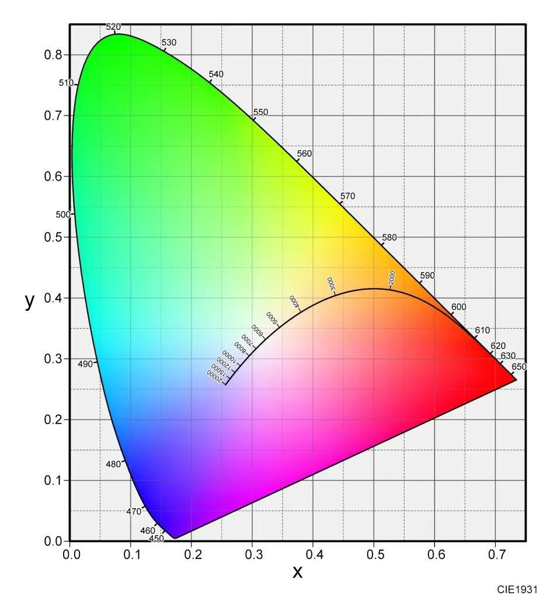

# 07 — 局部光照与着色

> **核心问题**：给定光源、材质和观察方向，如何计算物体表面每个点的颜色？

- [1. 局部光照 vs 全局光照](#1-局部光照-vs-全局光照)
- [2. 经验光照模型](#2-经验光照模型)
- [3. 光源模型](#3-光源模型)
- [4. 着色插值方法](#4-着色插值方法)
- [5. 着色工程问题](#5-着色工程问题)
- [6. 基于物理的渲染 (PBR)](#6-基于物理的渲染-pbr)
- [7. Cook-Torrance 微表面模型](#7-cook-torrance-微表面模型)
- [8. PBR vs 经验模型对比](#8-pbr-vs-经验模型对比)
- [9. 线性空间与伽马空间](#9-线性空间与伽马空间)
- [10. 颜色感知 (Color Perception)](#10-颜色感知-color-perception)
- [11. PBR 实践：Unity 与 GLTF](#11-pbr-实践unity-与-gltf)
- [常见考点](#-常见考点)
- [关键词索引](#关键词索引)

---

## 1. 局部光照 vs 全局光照

**局部光照 (Local Illumination)**：仅考虑**单个表面点 + 单个光源 + 观察者**，忽略阴影、反射、折射、间接光。

**全局光照 (Global Illumination)**：考虑光的所有路径，包括间接弹射（见第 09 章）。

---

## 2. 经验光照模型

### 2.1 通用分解公式

$$
I = I_E + K_A I_{AL} + \sum_i \left[ K_D (N \cdot L_i) I_{L_i} + K_S (V \cdot R_i)^n I_{L_i} \right]
$$

| 项 | 含义 | 说明 |
| :--- | :--- | :--- |
| $I_E$ | 自发光 (Emissive) | 物体本身发光 |
| $K_A I_{AL}$ | **环境光 (Ambient)** | 模拟间接光，纯工程补丁，**无物理依据** |
| $K_D (N \cdot L_i)$ | **漫反射 (Diffuse)** | Lambert 余弦定律 |
| $K_S (V \cdot R_i)^n$ | **镜面高光 (Specular)** | 光滑表面的反射亮点 |

### 2.2 Phong 光照模型

**镜面高光公式**（使用反射向量 $\mathbf{R}$）：
$$I_{spec} = I_{light} \cdot k_{spec} \cdot (\mathbf{R} \cdot \mathbf{V})^{shininess}$$

反射方向：$\mathbf{R} = 2(\mathbf{L} \cdot \mathbf{N})\mathbf{N} - \mathbf{L}$

**问题**：当 $\mathbf{L} \cdot \mathbf{N} < 0$（光源在表面背后），高光可能产生非物理的"断崖式"突变。

### 2.3 Blinn-Phong 光照模型

**镜面高光公式**（使用半角向量 $\mathbf{H}$）：
$$I_{spec} = I_{light} \cdot k_{spec} \cdot (\mathbf{N} \cdot \mathbf{H})^{shininess}$$

半角向量：$\mathbf{H} = \frac{\mathbf{L} + \mathbf{V}}{\|\mathbf{L} + \mathbf{V}\|}$

> **考点：几何直觉**：当你看向一个光滑表面时，只有法线恰好指向光线与视线之间的"中间方向"时，高光才最强。

**优势**：
- 计算更高效（向量加法 vs 反射向量计算）
- 高光更平滑，无 Phong 的突变问题
- 是 OpenGL/Vulkan 固定管线的默认镜面高光算法

### 2.4 Phong vs Blinn-Phong 对比

| 维度 | Phong | Blinn-Phong |
| :--- | :--- | :--- |
| 核心向量 | 反射向量 $\mathbf{R}$ | 半角向量 $\mathbf{H}$ |
| 计算量 | 较高（需计算 $\mathbf{R}$） | 较低（向量加法） |
| 高光形状 | 精确沿反射方向 | 更柔和、圆润 |
| 大角度行为 | 可能突变（夹角>90°时） | 平滑衰减 |
| 使用场景 | 理论上更"物理" | 实践中更常用 |

---

## 3. 光源模型

### 3.1 点光源 (Point Light)
$$I_L = \frac{I_0}{k_c + k_l d + k_q d^2}$$

- $k_c$：常数衰减 (Constant Attenuation)（防止分母过小）
- $k_l$：线性衰减 (Linear Attenuation)
- $k_q$：二次衰减 (Quadratic Attenuation)（物理上应为 $1/d^2$，但实践中常调参）
- 光线方向随表面点变化

### 3.2 方向光 (Directional Light)
- 无限远光源（如太阳），只有方向、无衰减
- 所有表面点入射方向相同

### 3.3 聚光灯 (Spotlight)
$$I_L = \frac{I_0 (\mathbf{D} \cdot \mathbf{L})^e}{k_c + k_l d + k_q d^2}$$

- $\mathbf{D}$：聚光主轴方向
- $e$：聚光指数 (Spotlight Exponent)（控制边缘柔和度）
- 衰减同时受距离和角度影响

---

## 4. 着色插值方法

> **考点：名称澄清**："Phong Shading"（着色插值策略）$$\neq$$ "Phong Illumination Model"（高光公式）。

| 方法 | 计算位置 | 插值内容 | 效果 |
| :--- | :--- | :--- | :--- |
| **Flat Shading** | 每个多边形一次 | 不插值 | 块状，明显马赫带 |
| **Gouraud Shading** | 顶点 | 顶点颜色 | 平滑，但高光易丢失 |
| **Phong Shading** | 逐像素 | 法线（插值后归一化） | 最精细，高光保留好 |

### 4.1 Flat Shading
- 一个多边形一个法线，一个颜色
- 问题：**马赫带效应 (Mach Band)** —— 人眼强化相邻面之间的亮度跳变

### 4.2 Gouraud Shading
步骤：
1. 计算每个顶点的法线（相邻面法线平均）
2. 每个顶点计算光照 → 顶点颜色
3. 光栅化时对顶点颜色双线性插值

**严重缺陷**：
- 高光集中在多边形内部时，顶点未捕捉到 → 高光完全消失
- 屏幕空间线性插值存在透视失真

### 4.3 Phong Shading（逐像素法线插值）
步骤：
1. 计算每个顶点法线（同 Gouraud）
2. 光栅化时对顶点法线双线性插值
3. **每像素归一化**后计算光照

**优点**：高光保留更完整，更接近真实表面曲率。
**缺点**：每像素光照计算量大（但现代 GPU 已不是瓶颈）。

### 4.4 三种着色对比总图

| 维度 | Flat | Gouraud | Phong |
| :--- | :--- | :--- | :--- |
| 每多边形计算次数 | 1 | V（顶点数） | P（像素数） |
| 高光质量 | 无 | 差（易丢失） | 好 |
| 马赫带 | 严重 | 缓解 | 缓解 |
| 现代使用 | 特殊风格化 | 移动端 | 标准 |
| GPU 开销 | 最低 | 低 | 中等 |

---

## 5. 着色工程问题

### 5.1 顶点法线计算
- 共享顶点法线：相邻面法线的加权平均（面积加权或简单平均）
- **尖锐边缘 (Sharp Edges / Crease Edges)**：需保留多组顶点法线（设置角度阈值，如 >60° 不平滑）

### 5.2 T-顶点 (T-Junction)
- 一个三角形边被另一个三角形分割 → 插值不一致 → 裂缝
- 解决方案：网格预处理避免 T-顶点，或统一细分

### 5.3 透视矫正 (Perspective Correction)
- 屏幕空间线性插值 $$\neq$$ 3D 空间线性插值
- 颜色/法线插值必须在透视投影下矫正
- 现代 GPU 自动提供（`noperspective` 需显式关闭）

### 5.4 插值后法线归一化
- 插值后的法线模长 $$\neq 1$$，必须归一化
- 同样适用于切向量 (Tangent)、副切向量 (Bitangent)（法线贴图）

---

## 6. 基于物理的渲染 (PBR)

### 6.1 渲染方程 (Kajiya 1986)

> 计算机图形学**最核心的公式**。

$$L_o(\mathbf{v}) = L_e(\mathbf{v}) + \int_{\Omega^+} f(\omega_i, \mathbf{v}) \, L_i(\omega_i) \, (\mathbf{n} \cdot \omega_i) \, d\omega_i$$

| 符号 | 含义 |
| :--- | :--- |
| $L_o(\mathbf{v})$ | 观察方向 $\mathbf{v}$ 上的出射辐射率 |
| $L_e(\mathbf{v})$ | 自发光辐射率 |
| $f(\omega_i, \mathbf{v})$ | **BRDF** |
| $L_i(\omega_i)$ | 入射辐射率 |
| $(\mathbf{n} \cdot \omega_i)$ | Lambert 余弦衰减 |
| $\Omega^+$ | 法线上方的半球空间 |

**通俗理解**：看到的颜色 = 自发光 + 半球上所有入射光的"加权积分"（每个方向 $$\times$$ BRDF $$\times$$ 余弦衰减）。

去除自发光 → **反射等式 (Reflectance Equation)**：
$$L_o(\mathbf{v}) = \int_{\Omega} f(\omega_i, \mathbf{v}) \, L_i(\omega_i) \, (\mathbf{n} \cdot \omega_i) \, d\omega_i$$

### 6.2 BRDF（双向反射分布函数）

> BRDF 是一个比例函数：给定入射方向 $\omega_i$ 和观察方向 $\omega_o$，返回有多少入射光能量被反射到观察方向。

$$f_r(\omega_i, \omega_o) = \frac{dL_o(\omega_o)}{dE_i(\omega_i)}$$

**BRDF 的假设**：光在表面上**同一点**入射和出射——这对金属、塑料等不透明材质足够，但对皮肤、大理石、牛奶等**半透明材质**失效。

### 6.2b BSSRDF（双向次表面散射反射分布函数）

> **考点：** BRDF vs BSSRDF 的区别——是否允许入射点和出射点不同。

当光进入半透明材质内部后，会在介质中**散射多次**，最终从与入射点**不同的位置**射出。BRDF 无法描述这种现象。

**BSSRDF** 将 BRDF 从 4D 推广到 8D，额外引入两个表面位置参数：

$$S(x_i, \omega_i, x_o, \omega_o) = \frac{dL_o(x_o, \omega_o)}{d\Phi_i(x_i, \omega_i)}$$

| 符号 | 含义 |
|:---|:---|
| $x_i$ | 光入射的表面点 |
| $x_o$ | 光出射的表面点（**可以与 $x_i$ 不同**） |
| $\omega_i, \omega_o$ | 入射/出射方向 |

**渲染方程在 BSSRDF 下的推广**：

$$L_o(x_o, \omega_o) = \int_A \int_{\Omega^+} S(x_i, \omega_i, x_o, \omega_o) \, L_i(x_i, \omega_i) \, (\mathbf{n} \cdot \omega_i) \, d\omega_i \, dA(x_i)$$

> 相比 BRDF 版本的渲染方程，这里在外层多了一个对**整个表面面积** $A$ 的积分——因为光可以从表面的任意位置出射。

**BRDF vs BSSRDF 对比**：

| 维度 | BRDF | BSSRDF |
|:---|:---|:---|
| 入射/出射位置 | **同一点** | **可不同点** |
| 维度 | 4D（两方向各 2D） | 8D（两位置各 2D + 两方向各 2D） |
| 适用材质 | 金属、塑料、木材 | 皮肤、牛奶、大理石、玉石、蜡 |
| 计算复杂度 | 低 | 极高（双重积分） |
| 代表性工作 | Phong, Cook-Torrance | Jensen et al. (SIGGRAPH 2001) |

**关键视觉现象**：BSSRDF 是产生**材质"温润/通透感"**（如皮肤、葡萄、玉石）的物理基础——光在表面下扩散后从别处溢出，形成柔和的散射光晕。

### 6.3 两条物理法则

| 法则 | 公式 | 含义 |
| :--- | :--- | :--- |
| **亥姆霍兹互易性** | $f(\omega_i, \omega_o) = f(\omega_o, \omega_i)$ | 光路可逆 |
| **能量守恒** | $\int_{\Omega} f(l, v)(n \cdot l)\,d\omega_o \leq 1$ | 反射总能量 $$\leq$$ 入射总能量 |

**BRDF 的两个物理成分**：
- **漫反射项 (Diffuse)**：次表面散射 (Subsurface Scattering)（光进入内部再射出）→ 底色
- **高光反射项 (Specular)**：表面反射（光在微表面直接反弹）→ 高光、光泽

### 6.4 Lambertian BRDF（漫反射）
$$f_{lambert} = \frac{c_{diff}}{\pi}$$

除以 $\pi$ 保证半球积分值为 1（能量守恒：$\int_{\Omega} (c/\pi) \cos\theta\,d\omega = c$）。

### 6.5 Disney BRDF 漫反射项（更真实）
$$f_{diff} = \frac{baseColor}{\pi} \cdot (1 + (F_{D90}-1)(1-n\cdot l)^5) \cdot (1 + (F_{D90}-1)(1-n\cdot v)^5)$$

其中 $F_{D90} = 0.5 + 2 \cdot roughness \cdot (h \cdot l)^2$。考虑掠射角 (Grazing Angle) 漫反射变化和粗糙度影响。

---

## 7. Cook-Torrance 微表面模型

> 实时渲染中最常用的 BRDF（Unity、UE4）。

$$f_{spec}(l, v) = \frac{F(l,h) \cdot G(l,v,h) \cdot D(h)}{4(n \cdot l)(n \cdot v)}$$

### 三个核心子函数

| 项 | 作用 | 控制效果 |
| :--- | :--- | :--- |
| **D(h)** — 法线分布函数 (NDF) | 多少微面元的法线 = 半角向量 $h$ | 高亮的**大小和模糊程度** |
| **F(l,h)** — 菲涅尔反射函数 | 反射光占入射光的比例 | 边缘反光的**强度和颜色** |
| **G(l,v,h)** — 阴影-遮挡函数 | 多少微面元未被遮挡 | 粗糙表面的**暗角效应** |

**分母 $4(n \cdot l)(n \cdot v)$**：从微表面局部空间到宏观表面的校正因子。

### 7.1 NDF — GGX（主流）

$$D_{GGX}(h) = \frac{\alpha^2}{\pi((\alpha^2-1)(n \cdot h)^2 + 1)^2}, \quad \alpha = roughness^2$$

高光更明亮、更集中，拖尾更长（更接近真实材质测量）。

### 7.2 菲涅尔 — Schlick 近似

$$F_{Schlick}(l,h) = F_0 + (1-F_0)(1-(l \cdot h))^5$$

- 金属：$F_0$（法线入射反射率）值大且有颜色（如金 $F_0 \approx (1,0.71,0.29)$）
- 非金属（电介质）：$F_0$ 值小且为灰度（约 0.04）

> **提示：菲涅尔效应 (Fresnel Effect)**：掠射角（视线几乎平行于表面）时所有材质反射率急剧升高。

### 7.3 几何函数 — Smith-Joint GGX（史密斯联合GGX）

**可见性项**（组合 G 和分母）：
$$V = \frac{1}{(n \cdot l)(1-k)+k} \cdot \frac{1}{(n \cdot v)(1-k)+k}, \quad k = \frac{roughness^2}{2}$$

---

## 8. PBR vs 经验模型对比

| 维度 | Phong / Blinn-Phong | PBR (Cook-Torrance) |
| :--- | :--- | :--- |
| **理论基础** | 经验公式（美术直觉） | 物理光学 + 微积分 |
| **能量守恒** | 否 不保证 | 是 严格保证 |
| **菲涅尔效应** | 否 无 | 是 自动包含 |
| **粗糙度控制** | 单一 `shininess` 指数 | 物理单位 `roughness` 0~1 |
| **金属/非金属** | 无法区分 | 通过 `Metallic`（金属度）参数区分 |
| **光照适应性** | 环境变了需重新调参 | 材质在任何光照下物理正确 |

> **提示：PBR 的最大价值**：美术不需要为不同光照环境反复调参。

---

## 9. 线性空间与伽马空间

> **考点：** PBR 必须使用线性空间！

**伽马空间 (Gamma Space)**：纹理以 sRGB（标准RGB色彩空间）存储（非线性，暗部更多编码精度），若直接计算 → 结果不真实。

**线性空间**：
- 采样 sRGB 纹理时硬件自动解码到线性空间
- 所有光照计算在线性空间进行
- 输出前自动伽马校正

**为什么 PBR 必须线性空间？**
- 光照叠加（加法）只在物理线性空间正确
- 在伽马空间做光照混合 → 偏暗、偏艳、混合异常

---

## 10. 颜色感知 (Color Perception)

> **考点：** 人眼感知原理是颜色科学的基石，概念题高频。

### 10.1 人眼的光感受器：视锥细胞与视杆细胞

| 感受器 | 数量（每眼） | 分布 | 功能 |
|:---|:---|:---|:---|
| **视杆细胞 (Rods)** | 约 1.2 亿 | 周边为主 | 低光环境（夜视），无色感 |
| **视锥细胞 (Cones)** | 约 600 万 | 中央凹 (Fovea) | 高光环境，色彩感知 |

**三种视锥细胞**及其峰值光谱灵敏度：

| 类型 | 峰值波长 | 敏感颜色 | 占比 |
|:---|:---|:---|:---|
| **S-cone（短波长敏感视锥, Short-wavelength）** | ~420 nm | 蓝紫 | ~5% |
| **M-cone（中波长敏感视锥, Medium-wavelength）** | ~530 nm | 绿 | ~30% |
| **L-cone（长波长敏感视锥, Long-wavelength）** | ~560 nm | 黄绿 | ~65% |

> 三种视锥细胞的响应曲线**有重叠**——这是人类能感知连续光谱（而非仅三个"点"）的关键。

**三刺激值 (Tristimulus Values)**：任何一种可见颜色都可以用三个值 (S, M, L) 唯一表示（对应三种视锥细胞的响应强度）。

> **色盲**的本质：某一类视锥细胞缺失或光谱灵敏度偏移（最常见：红绿色盲，L/M 锥体响应曲线过于接近）。

### 10.2 颜色模型：显示器 vs 打印机

| 维度 | RGB（加色混合, Additive） | CMY/CMYK（减色混合, Subtractive） |
|:---|:---|:---|
| **应用** | 显示器、投影仪 | 打印机、印刷 |
| **原理** | 叠加不同颜色的**光** → 最终颜色 | 叠加不同颜色的**墨水/染料** → 吸收（减去）光 |
| **基色** | R (红), G (绿), B (蓝) | C (青, Cyan), M (品红, Magenta), Y (黄, Yellow) |
| **黑** | R+G+B = 白（全亮） | C+M+Y = 黑（全吸收，但实际得深棕） |
| **为什么有 K？** | — | CMY 三色混合得不纯 → 加 K (Key/Black) 墨节省墨水 + 真正黑 |

**CMY ↔ RGB 转换**：
$$C = 1 - R, \quad M = 1 - G, \quad Y = 1 - B$$

**互补色关系**：R 的互补是 C，G 的互补是 M，B 的互补是 Y。

### 10.3 CIE 色度图 (CIE Chromaticity Diagram)

> **考点：** CIE XYZ 系统和色度图的概念。

**背景**：RGB 三原色混合可以覆盖的范围有限，甚至会出现"负光强"才能匹配的颜色。

**CIE 1931 XYZ 色彩空间**：定义三种**虚拟原色** X, Y, Z（并非实际的 R, G, B），使得：
1. 所有可见颜色都有正的 X, Y, Z 分量
2. Y 分量恰好等于**亮度 (Luminance)**

**色品坐标 (Chromaticity Coordinates)**：
$$x = \frac{X}{X+Y+Z}, \quad y = \frac{Y}{X+Y+Z}, \quad z = \frac{Z}{X+Y+Z} = 1 - x - y$$

用 $(x, y)$ 即可表示颜色（去除亮度维度），形成二维**色度图**：



**关键概念**：

- **马蹄形边界 (Spectral Locus)**：单色光的轨迹（最纯的颜色）
- **紫色线 (Purple Line)**：连接蓝色和红色，非单色（混合色）
- **白点 (White Point)**：不同标准白（D65: 日光, D50: 暖色）
- **色域 (Gamut)**：显示器能显示的颜色范围 = RGB 三点围成的三角形（是 CIE 的子集）

> 这解释了为什么**显示器永远无法显示所有可见颜色**——色域三角形无法覆盖整个马蹄形。

### 10.4 Alpha 通道与半透明合成

**Alpha 通道**：RGBA 中的 A 分量，表示像素的**不透明度 (Opacity)**。

| Alpha 值 | 含义 |
|:---|:---|
| 1.0 | 完全不透明 |
| 0.0 | 完全透明 |
| 0~1 | 半透明 |

#### 半透明表面合成 (Over Operator)

将前景颜色 $C_{src}$（alpha $\alpha$）合成到背景颜色 $C_{dst}$ 上：

$$C_{final} = \alpha \cdot C_{src} + (1 - \alpha) \cdot C_{dst}$$

**前提**：需要按深度**从远到近排序**（同 Blending 章节所述）。

#### 预乘 Alpha (Premultiplied Alpha)

先乘 alpha 再存储：$C' = (\alpha R, \alpha G, \alpha B, \alpha)$。

合成公式简化为：
$$C_{final} = C'_{src} + (1 - \alpha_{src}) \cdot C'_{dst}$$

**优势**：一次乘法/一次加法，且对滤波（Mipmap）更友好。

### 10.5 HDR 图像 (High Dynamic Range)

> **考点：** HDR vs LDR (SDR) 的核心区别。

**LDR (低动态范围) / SDR (标准动态范围)**：
- 每通道 8 位 (0-255)
- 色域小 (sRGB)
- 亮处过曝 → 纯白（clipping）

**HDR (高动态范围)**：
- 每通道 **10 位 / 12 位 / 16 位浮点 (FP16)**
- 亮处保留细节而非截断
- 需要 HDR 显示器 + **色调映射 (Tone Mapping)** 转换到显示范围

| 格式 | 每像素位数 | 色域 | 亮度范围 |
|:---|:---|:---|:---|
| SDR (sRGB 8-bit) | 24 (3×8) | sRGB | ~100 nit |
| HDR10 | 30 (3×10) | Rec.2020 | 1000+ nit |
| Dolby Vision | 36 (3×12, dynamic metadata) | Rec.2020 | 4000+ nit |
| **scRGB FP16** | 48 (3×16) | Extended sRGB | >10000 nit |

**色调映射 (Tone Mapping)**：
- HDR → 显示器有限范围的**非线性压缩**
- 经典算子：Reinhard, ACES (Academy Color Encoding System) Filmic, Hable
- 目的：保留高亮细节并产生自然的"胶片"外观

---

## 11. PBR 实践：Unity 与 GLTF

> **考点：** 理解 PBR 在实际引擎和标准格式中的体现。

### 11.1 Unity Built-In Render Pipeline 的 Standard Shader

Unity 标准着色器的 PBR 参数：

| 参数 | 含义 |
|:---|:---|
| **Albedo** | 基础颜色（非金属）或 $F_0$（金属） |
| **Metallic** | 金属度 (0~1)，0=非金属, 1=纯金属 |
| **Smoothness** | 光滑度 = 1 − roughness |
| **Normal Map** | 法线贴图（切线空间） |
| **Occlusion** | 环境光遮蔽（AO，减少间接光） |
| **Emission** | 自发光（不影响全局光照） |

**Metallic 工作流**：仅用 Albedo + Metallic 即可模拟几乎所有真实材质，无需分离 Specular 颜色。

### 11.2 GLTF：标准 3D 资产交换格式

**GLTF (GL Transmission Format)** = "3D 的 JPEG"。Khronos Group 维护。

| 特性 | 说明 |
|:---|:---|
| **默认 PBR 材质** | Metallic-Roughness 模型（同 Unity/Unreal） |
| **纹理格式** | Base Color, Normal, Metallic-Roughness (打包), Occlusion, Emissive |
| **二进制版本** | GLB (单一文件，包含几何+纹理+动画) |
| **动画** | 支持骨骼动画 (Skinning) 和变形目标 (Morph Target) |
| **PBR 参数** | `baseColorFactor`, `metallicFactor`, `roughnessFactor` |

```json
// GLTF PBR 材质示例 (JSON 部分)
"materials": [{
  "pbrMetallicRoughness": {
    "baseColorFactor": [0.8, 0.2, 0.1, 1.0],
    "metallicFactor": 0.0,
    "roughnessFactor": 0.5
  }
}]
```

**GLTF 的意义**：跨引擎一致外观——在 Blender、Unity、Unreal 中导入同一个 GLTF 文件，材质看起来相同。

---

## 常见考点

1. **Flat / Gouraud / Phong Shading 的区别？** → 计算位置：面/顶点/像素；插值内容：无/颜色/法线
2. **"Phong Shading" 和 "Phong 光照模型" 的区别？** → 前者是逐像素法线插值策略，后者是高光公式（使用反射向量 R）
3. **Blinn-Phong 为什么比 Phong 更常用？** → 计算更简单（H vs R），高光无断崖式突变
4. **渲染方程各部分物理含义？** → 自发光 + 半球入射光的 BRDF 加权积分
5. **BRDF 和 BSSRDF 的本质区别？** → BRDF 假设光在同一点入射/出射（4D）；BSSRDF 允许不同点（8D），用于半透明材质（皮肤/牛奶/玉石）
6. **BRDF 的能量守恒如何保证？** → 半球积分 $$\leq 1$$；Lambertian BRDF 中除以 $\pi$
6. **Cook-Torrance 模型中 D/F/G 分别控制什么？** → D: 高光形状, F: 边缘反射率, G: 自遮挡暗角
7. **为什么 PBR 必须在线性空间计算？** → 光照叠加是物理线性操作，伽马空间计算会出错
8. **菲涅尔效应的直观理解？** → 掠射角时所有材质反射率升高（水面、玻璃边缘更亮）
9. **金属 vs 非金属在 PBR 中的本质区别？** → 金属的 $F_0$ 大且有颜色（金属无漫反射），非金属 $F_0 \approx 0.04$ 且灰度
10. **三种视锥细胞的作用？** → S-cone (蓝~420nm), M-cone (绿~530nm), L-cone (黄绿~560nm)，响应曲线有重叠
11. **RGB vs CMY/CMYK 的区别？** → RGB 用于发光设备（加色混合），CMY(K) 用于打印（减色混合，C=1-R, M=1-G, Y=1-B）
12. **CIE 色度图中的 $(x, y)$ 坐标含义？** → $x, y$ = 标准化 X, Y 分量，去除亮度维度的"纯颜色"坐标；白点 (0.33, 0.33)
13. **Alpha 通道的 Over 合成公式？** → $C_{final} = \alpha C_{src} + (1-\alpha) C_{dst}$
14. **HDR 图像与 SDR 的本质差别？** → HDR 每通道 10-16 位（保留高亮细节），SDR 每通道 8 位（亮处截断）
15. **GLTF 是什么？** → "3D 的 JPEG"，Khronos 标准 3D 交换格式，默认 PBR (Metallic-Roughness)

---

## 关键词索引

`局部光照` `全局光照` `环境光` `漫反射` `镜面高光` `Phong光照模型` `Blinn-Phong` `半角向量` `Lambert余弦定律` `点光源` `方向光` `聚光灯` `距离衰减` `Flat Shading` `Gouraud Shading` `Phong Shading` `马赫带` `T-顶点` `顶点法线` `透视矫正` `PBR` `渲染方程` `BRDF` `BSSRDF` `次表面散射` `Cook-Torrance` `微表面` `NDF` `GGX` `菲涅尔` `Schlick近似` `几何函数` `能量守恒` `互易性` `金属工作流` `粗糙度` `线性空间` `伽马空间` `sRGB` `法线插值` `MRT` `IBL` `视锥细胞` `S-cone` `M-cone` `L-cone` `RGB` `CMY` `CMYK` `加色混合` `减色混合` `CIE色度图` `色品坐标` `XYZ三原色` `Alpha通道` `半透明合成` `Over运算` `预乘Alpha` `HDR` `色调映射` `Tone Mapping` `Unity Standard Shader` `GLTF` `Metallic-Roughness`
